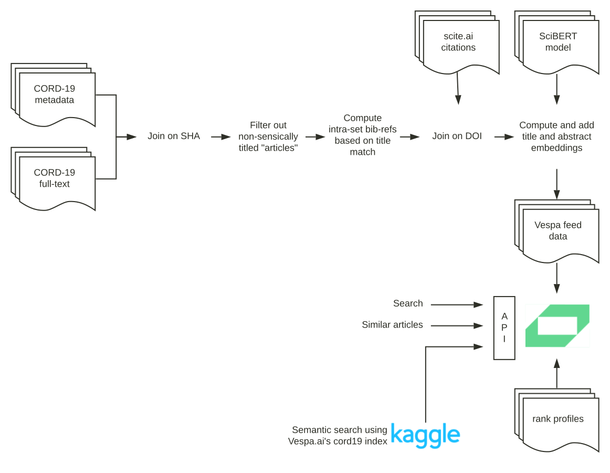

<!-- Copyright Verizon Media. Licensed under the terms of the Apache 2.0 license. See LICENSE in the project root. -->
# About CORD-19 Search
_CORD-19 Search_ is built on Vespa Cloud:

* Use the Query API to _search_.
  Coming: Use the left frame to navigate / drill down / refine the query
* Coming: From the article view, find _similar articles_

The application is implemented as a
[Vespa Cloud sample application](https://github.com/vespa-engine/sample-apps/tree/master/vespa-cloud/cord-19-search).
Refer to [experiment yourself](https://github.com/vespa-engine/sample-apps/blob/master/vespa-cloud/cord-19-search/experiment-yourself.md)
to try out different rank profiles, including ML models.

Find the frontend code in this repo in [src/App](/src/App).
