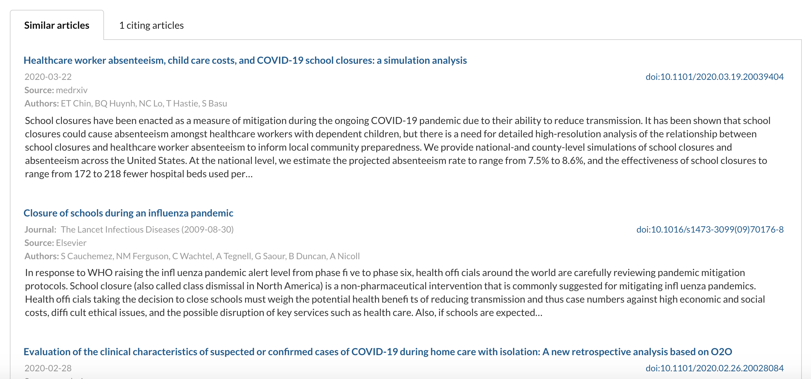

<!-- Copyright Verizon Media. Licensed under the terms of the Apache 2.0 license. See LICENSE in the project root. -->
# Semantic similarity for the CORD-19 dataset 

A nice feature of the [cord19.vespa.ai](https://cord19.vespa.ai/) application is its ability to display similar articles to the one being read, as displayed in the figure below. We have implemented one of the most sophisticated techniques, called semantic similarity, to display those related articles.

In a nutshell, semantic similarity maps text data to a multi-dimensional vector space in such a way that similar texts are closer together than unrelated texts. The challenge with semantic similarity is to find a map that preserves the semantic meaning of the text. That way, similar texts will be closer together even when they don't share many of the same words, as long as they have similar meaning.

## The mapping

The mapping used to convert text to vectors is the [fine-tuned version](https://huggingface.co/gsarti/scibert-nli) of a [pre-trained language model](https://www.aclweb.org/anthology/D19-1371/) specifically trained for scientific text. We are therefore using the state of the art algorithm available at the moment for the context of the CORD-19 dataset.

## Retrieving the best related articles

Once we have a useful mapping, we need to decide how to apply it. In this case we decided to map both the title and the abstract for all articles available. Once a new article is selected for reading, Vespa will retrieve 100 articles with similar titles plus 100 articles with similar abstracts and then rank those 200 articles according to one of the ranking functions available in the frontend.

Vespa will retrieve those articles based on the (Euclidean) distance between the title vectors and the abstract vectors. It can compute the distance for all the articles available in the dataset in milliseconds thanks to the efficient implementation of the [Nearest Neighbor operator](https://docs.vespa.ai/documentation/reference/query-language-reference.html#nearestneighbor).  